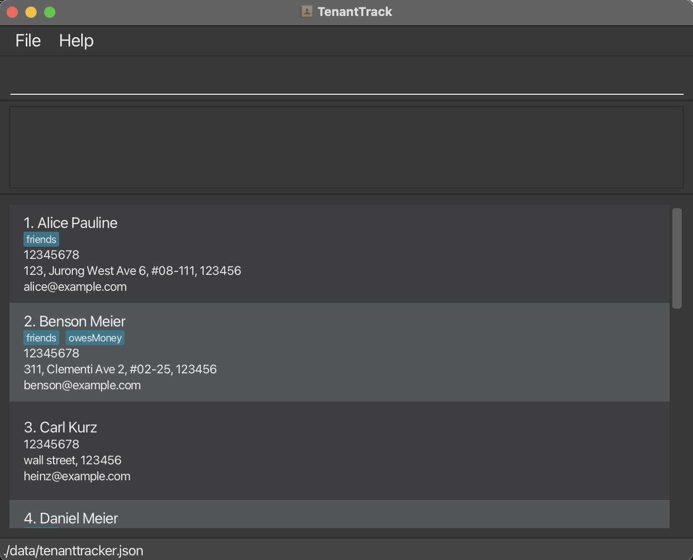

# TenantTrack 

## About
TenantTrack is a software project designed to assist **landlords who manage multiple rental properties**. It aims to streamline contact management by providing an **efficient and user-friendly** interface optimized for both command-line interaction and a graphical user interface (GUI). 
  
## Example usages are:
- **As a starting point for a software engineering course project**, allowing students to build upon an existing well-structured codebase.
- **As a case study** for software engineering concepts such as object-oriented design, CLI/GUI integration, and user-centered development.
- **As a reference implementation** for projects involving tenant and property management.
- 
* The project simulates an ongoing software project for a desktop application (called _AddressBook_) used for managing contact details.
  * It is **written in OOP fashion**. It provides a **reasonably well-written** code base **bigger** (around 6 KLoC) than what students usually write in beginner-level SE modules, without being overwhelmingly big.
  * It comes with a **reasonable level of user and developer documentation**.

## Key Design Aspects

- **Optimized for power users** – The application prioritizes CLI-based interaction while maintaining GUI functionality for accessibility.
- **Structured and scalable** – Implements clear data structures to handle tenant information efficiently.
- **Error handling and validation** – Ensures proper input validation for tenant names and addresses, including postcode verification.
- **Duplicate handling** – Allows duplicate names and addresses while considering future extensions for unique identifiers.
 
## Project Features
TenantTrack provides core functionality for managing tenant information efficiently:

1. **Add Tenant** – Allows landlords to add tenants with their names and addresses.
2. **View Tenant Details** – Displays stored tenant details for quick reference.
3. **Delete Tenant** – Removes a tenant from the system using an ID.
4. **List Tenants** – Retrieves all tenants and their associated properties.

* For the detailed documentation of this project, see the **[Tenant Track Product Website](https://se-education.org/addressbook-level3)**.
* This project is a **part of the se-education.org** initiative. If you would like to contribute code to this project, see [se-education.org](https://se-education.org/#contributing-to-se-edu) for more info.

## Acknowledgement
This project is based on the AddressBook-Level3 project created by the [SE-EDU initiative](https://se-education.org).
